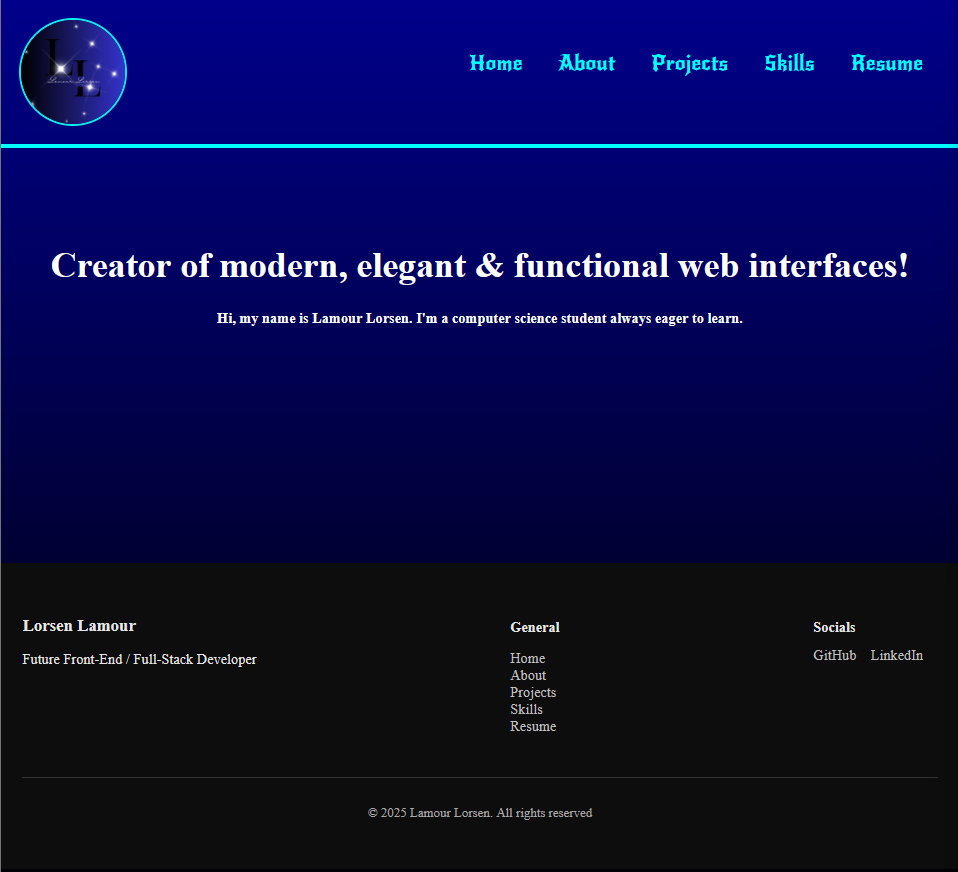
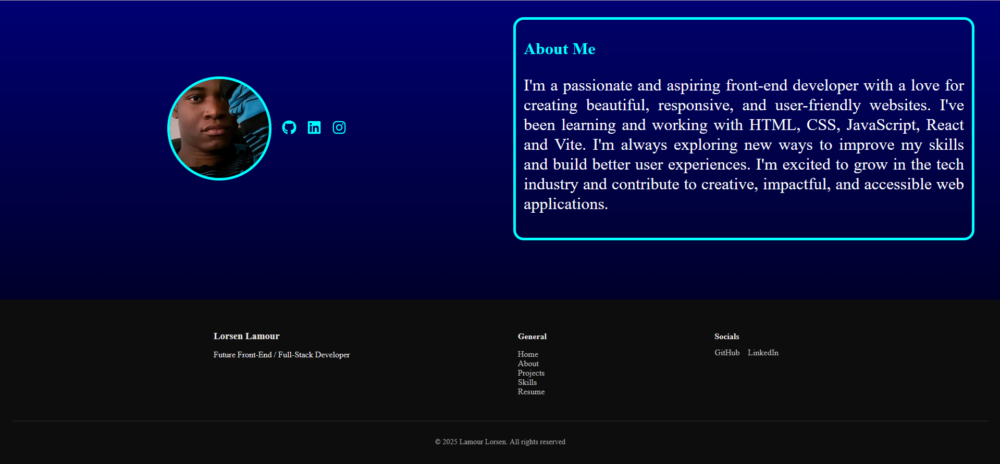

# my-portfolio
Personal web portfolio built with React + Vite and styled with custom CSS. Showcases my front-end development projects, skills, and background.

## Getting Started

To run this project locally, follow the steps below:

### 1. Clone the repository

git clone https://github.com/LorsenLamour/my-portfolio.git
cd my-portfolio

### 2. Install dependencies
npm install or npm i

### 3. Install dependencies
npm start

# Portfolio overview (Still in progress...)

### 1. Home Page

### 2. About Page

# Color I might use
1. 
background: #ef32d9;  /* fallback for old browsers */
background: -webkit-linear-gradient(to right, #89fffd, #ef32d9);  /* Chrome 10-25, Safari 5.1-6 */
background: linear-gradient(to right, #89fffd, #ef32d9); /* W3C, IE 10+/ Edge, Firefox 16+, Chrome 26+, Opera 12+, Safari 7+ */

2. 
background: #3a7bd5;  /* fallback for old browsers */
background: -webkit-linear-gradient(to right, #3a6073, #3a7bd5);  /* Chrome 10-25, Safari 5.1-6 */
background: linear-gradient(to right, #3a6073, #3a7bd5); /* W3C, IE 10+/ Edge, Firefox 16+, Chrome 26+, Opera 12+, Safari 7+ */

# Links & Sources  

0. React-icon               =>  https://react-icons.github.io/react-icons/
1. UIgradients  (color)     =>  https://uigradients.com/#BoraBora
2. GradientHunt (color)     =>  https://gradienthunt.com/
3. Fonts-Google             =>  https://fonts.google.com/
4. Lucide React             => https://lucide.dev/guide/packages/lucide-react
